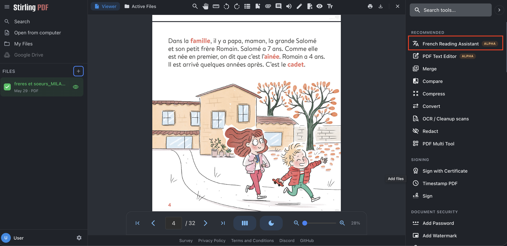
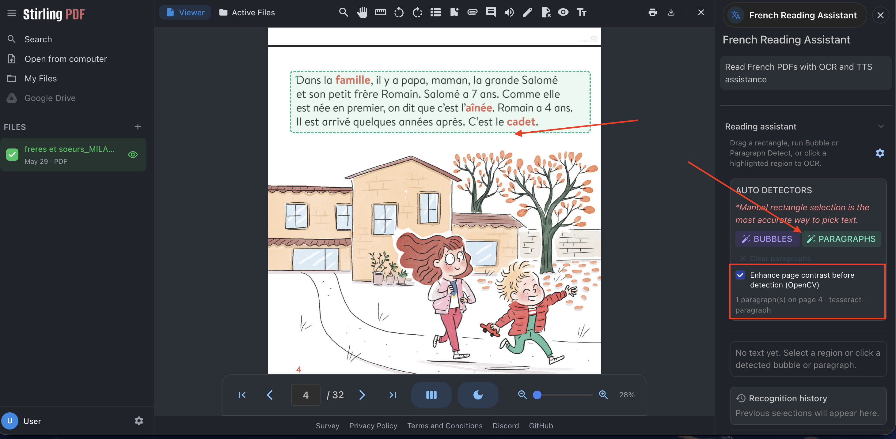
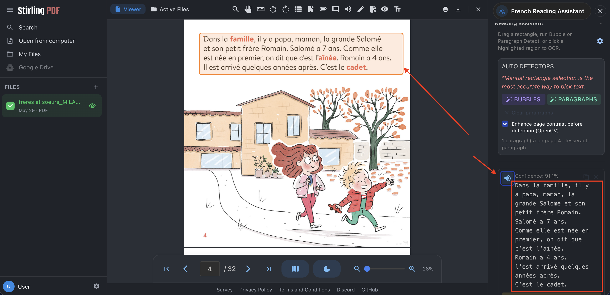
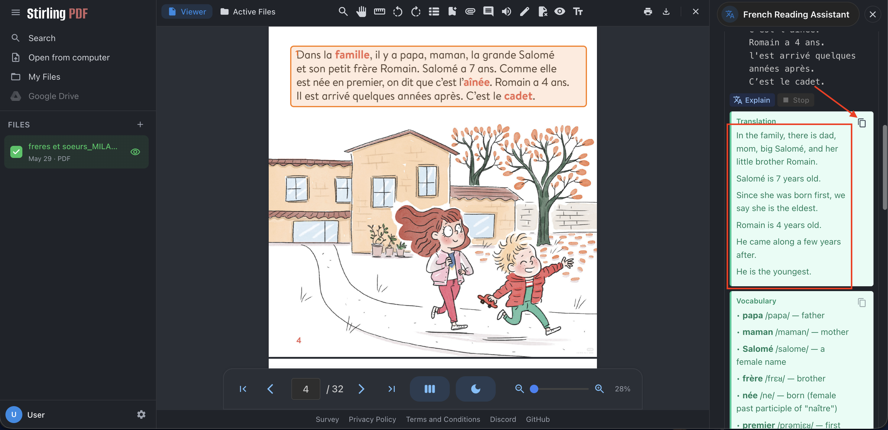
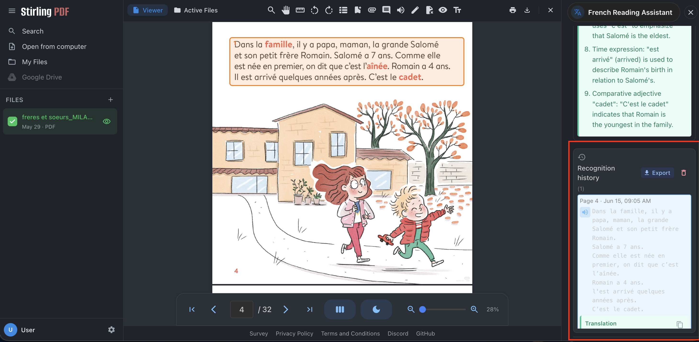
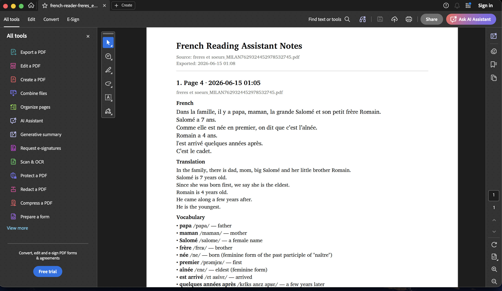

# French Reading Assistant for Stirling PDF

> **Base application:** [**Stirling PDF**](https://github.com/Stirling-Tools/Stirling-PDF) — open-source PDF toolkit (merge, split, OCR, AI Agent, Tauri desktop, Docker, and more).  
> **This repository** ([`FrenchReadingAssisstant-stirlingPDF`](https://github.com/FuyinChe/FrenchReadingAssisstant-stirlingPDF)) adds a **French Reading Assistant** plugin: region selection → French OCR → TTS → AI explanation. Stirling core behavior is unchanged; extensions live under `extensions/`.

> **基座应用：** [**Stirling PDF**](https://github.com/Stirling-Tools/Stirling-PDF) — 开源 PDF 工具集（合并、拆分、OCR、AI Agent、Tauri 桌面、Docker 等）。  
> **本仓库**（[`FrenchReadingAssisstant-stirlingPDF`](https://github.com/FuyinChe/FrenchReadingAssisstant-stirlingPDF)）在其上挂载 **法语阅读助手** 插件：框选 → 法语 OCR → 朗读 → AI 释义。不改动 Stirling 核心；扩展代码位于 `extensions/`。

| Language | 语言 | Documentation |
|----------|------|---------------|
| English | 英文 | [docs/en/getting-started.md](docs/en/getting-started.md) · [docs/en/user-guide.md](docs/en/user-guide.md) |
| 中文 | Chinese | [docs/zh/getting-started.md](docs/zh/getting-started.md) · [docs/zh/user-guide.md](docs/zh/user-guide.md) |
| Index | 文档中心 | [docs/README.md](docs/README.md) |

---

## Features / 功能

| | English | 中文 |
|---|---------|------|
| Base | Full **Stirling PDF** feature set | 保留 **Stirling PDF** 全部能力 |
| Plugin | **French Reading Assistant** tool | **French Reading Assistant** 工具 |
| OCR / TTS / AI | French OCR, edge-tts, multi-vendor LLM | 法语 OCR、edge-tts、多厂商 LLM |
| Planned | YOLO bubble detection (comics) | 漫画气泡检测（规划中） |

Upstream links: [Stirling PDF repo](https://github.com/Stirling-Tools/Stirling-PDF) · [Stirling docs](https://docs.stirlingpdf.com/) · [DeveloperGuide](https://github.com/Stirling-Tools/Stirling-PDF/blob/main/DeveloperGuide.md)

---

## Quick start (development) / 快速开始（开发）

```bash
git clone --recursive https://github.com/FuyinChe/FrenchReadingAssisstant-stirlingPDF.git
cd FrenchReadingAssisstant-stirlingPDF
# If you cloned without --recursive:
git submodule update --init --recursive
chmod +x scripts/*.sh
./scripts/install-extensions.sh
./scripts/dev.sh
```

Open Stirling at http://localhost:5173 → **Recommended tools** → **French Reading Assistant**.

---

## Docker / Docker 部署

> **普通用户：** 不建议使用 Docker。目标体验是 [GitHub Releases 桌面包 / 免安装 zip](docs/plan/10-distribution-strategy.md)。  
> **End users:** Prefer the desktop installer/portable zip (see distribution strategy). Docker is for self-hosting / IT.

Images are **built locally** from this repo (nothing is pushed to Docker Hub by default).

```bash
cp .env.docker.example .env   # optional: LLM API key
./scripts/docker-up.sh          # or: docker compose up --build
```

Browser: http://localhost:8080 → **French Reading Assistant**.

See [docs/en/getting-started.md#docker](docs/en/getting-started.md#docker) · [docs/zh/getting-started.md#docker](docs/zh/getting-started.md#docker).

---

## Desktop (Tauri) / 桌面版

> **规划中（M7）：** 面向普通用户的 `.dmg` / `.exe` 一键安装；当前脚本供开发者构建。详见 [发行策略](docs/plan/10-distribution-strategy.md)。

```bash
./scripts/build-desktop.sh
./scripts/desktop-dev.sh
```

Requires JDK 25, Node 20+, Rust (see [Stirling DeveloperGuide](https://github.com/Stirling-Tools/Stirling-PDF/blob/main/DeveloperGuide.md)).

---

## Documentation / 文档

| Topic | EN | 中文 |
|-------|----|------|
| Getting started | [docs/en/getting-started.md](docs/en/getting-started.md) | [docs/zh/getting-started.md](docs/zh/getting-started.md) |
| User guide (+ screenshots) | [docs/en/user-guide.md](docs/en/user-guide.md) | [docs/zh/user-guide.md](docs/zh/user-guide.md) |
| Dev setup (detailed) | [docs/dev-setup.md](docs/dev-setup.md) | 同上（中英混排，偏开发者） |
| Architecture / plan | [docs/plan/](docs/plan/) | 计划文档（中文为主） |
| Sidecar fallback | [docs/deployment/sidecar-fallback.md](docs/deployment/sidecar-fallback.md) | Sidecar 降级（技术用户） |
| **Windows portable ZIP** | [docs/deployment/windows-portable-packaging.md](docs/deployment/windows-portable-packaging.md) | Windows 解压即用 |
| **macOS portable ZIP** | [docs/deployment/macos-portable-packaging.md](docs/deployment/macos-portable-packaging.md) | macOS ARM + Intel 解压即用 |
| **End-user distribution** | [docs/plan/10-distribution-strategy.md](docs/plan/10-distribution-strategy.md) | **普通用户发行策略（桌面包优先）** |

## Screenshots / 截图

Preview images below; step-by-step gallery: [User guide (EN)](docs/en/user-guide.md) · [用户手册（中文）](docs/zh/user-guide.md)


*Figure — Recommended tools → French Reading Assistant.*


*Figure — PARAGRAPHS detector on a picture-book page.*


*Figure — Drag a rectangle → recognized text with confidence.*


*Figure — Translate + Vocabulary output after Explain.*


*Figure — History entries with TTS and export.*


*Figure — PDF export with French, translation, and vocabulary.*

---

## Stack / 技术栈

```
Base:       Stirling PDF (git submodule → stirling-upstream/)
            https://github.com/Stirling-Tools/Stirling-PDF
Extension:  extensions/french-reader-frontend/  (React Tool)
            extensions/french-reader-engine/    (FastAPI sidecar :5002)
Integration: minimal patches + FRENCH_READER_ENABLED flag
```

Architecture: [docs/images/shared/architecture.md](docs/images/shared/architecture.md)

---

## License / 许可证

| Scope | License |
|-------|---------|
| **French Reading Assistant** (`extensions/`, `scripts/`, `packaging/`, `docs/` in this repo) | [**MIT**](LICENSE) |
| **Stirling PDF** (`stirling-upstream/` submodule, bundled in portable `app/`) | **Mixed** — MIT for most code; see [licenses/STIRLING-PDF-LICENSE](licenses/STIRLING-PDF-LICENSE) and Stirling `engine/` / proprietary paths |
| **Third-party** (Tesseract, JRE, PyPI deps) | [THIRD-PARTY-NOTICES.md](THIRD-PARTY-NOTICES.md) |

French Reading Assistant is a **third-party extension** based on Stirling PDF; it is **not** an official Stirling PDF product.

Details: [docs/plan/07-license-compliance.md](docs/plan/07-license-compliance.md) · [licenses/README.md](licenses/README.md)

**中文：** 本仓库自研扩展部分为 **MIT**；基座 Stirling PDF 为**混合许可**（主体 MIT，部分目录另有条款）。便携包内附 `LICENSE` 与 `THIRD-PARTY-NOTICES.md`。
