# User guide — French Reading Assistant

Use the French Reading Assistant **inside [Stirling PDF](https://github.com/Stirling-Tools/Stirling-PDF)**: select a region → French OCR → read aloud → AI explanation.

[用户手册（中文）](../zh/user-guide.md) · [Getting started](getting-started.md) · [Screenshot conventions](../images/README.md)

---

## Before you start

| Mode | Command |
|------|---------|
| Development | `./scripts/dev.sh` ([dev-setup.md](../dev-setup.md)) |
| Docker | `./scripts/docker-up.sh` |
| Desktop / portable | `Start French Reading Assistant` launcher (see [distribution strategy](../plan/10-distribution-strategy.md)) |

AI features need an LLM API key: Settings → LLM provider, or `FRENCH_READER_LLM_API_KEY` in `.env`. TTS uses edge-tts (network required).

---

## Open the tool

1. Open a PDF in Stirling (same as usual).
2. In the tool list, open **French Reading Assistant** under **Recommended tools**.
3. Layout: PDF canvas on the left, AI sidebar on the right.

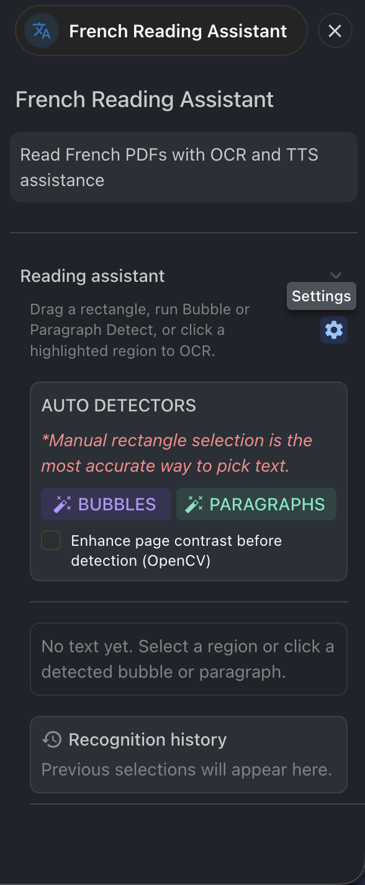

*Figure 1 — Reading assistant panel: auto detectors, settings, and history.*

---

## Selection and OCR

### Manual selection (recommended)

1. Drag a rectangle on the page.
2. French OCR runs on the selection; text appears under **Recognized text**.

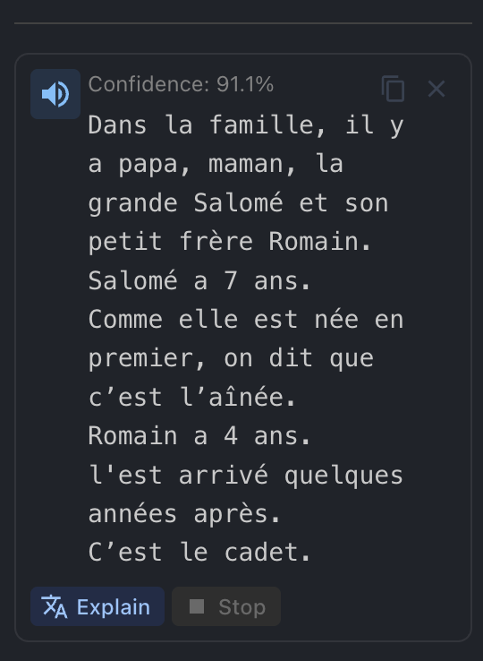

*Figure 2 — OCR result, confidence, and action buttons.*

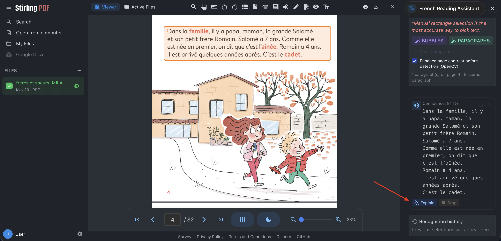

*Figure 3 — Explain runs AI modes on the current selection.*

### Auto detectors

In the sidebar **AUTO DETECTORS**:

| Button | Use |
|--------|-----|
| **BUBBLES** | Comic speech bubbles |
| **PARAGRAPHS** | Picture-book / page paragraphs |

- Enable **Enhance page contrast before detection (OpenCV)** for difficult backgrounds.
- Green dashed boxes show detections; verify important text with manual selection.
- Red italic banner: auto-detect is advisory only.

**Comics (bubbles)**

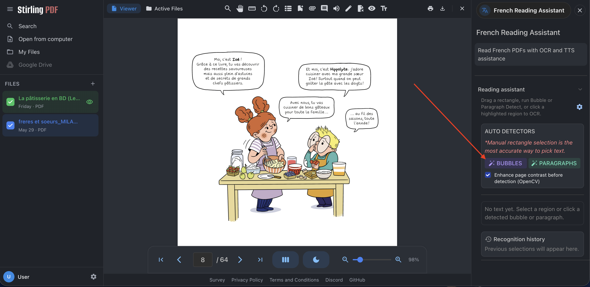

*Figure 4 — Comic PDF: use BUBBLES on speech balloons.*

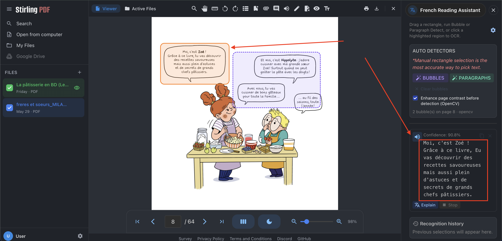

*Figure 5 — Detected bubbles → OCR text per balloon.*

**Picture books (paragraphs)**

*Figure 6 — Paragraph detector on a text block (same as README preview).*

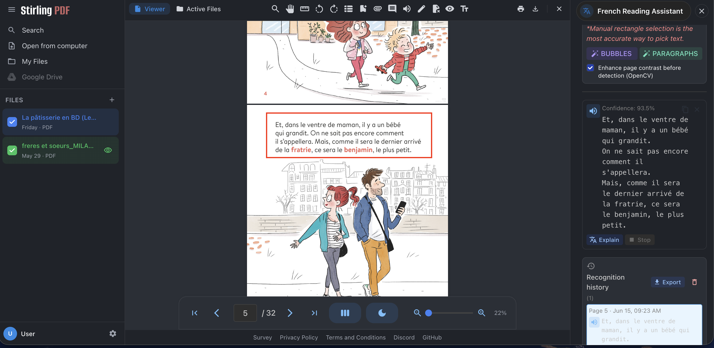

*Figure 7 — Manual selection on a paragraph-style page.*

---

## Text-to-speech (TTS)

1. After OCR, open **Settings** → choose French voice and speed under **Pronunciation**.
2. Click the speaker icon on the recognized text (or **Read aloud** where shown).
3. Uses edge-tts (network required).

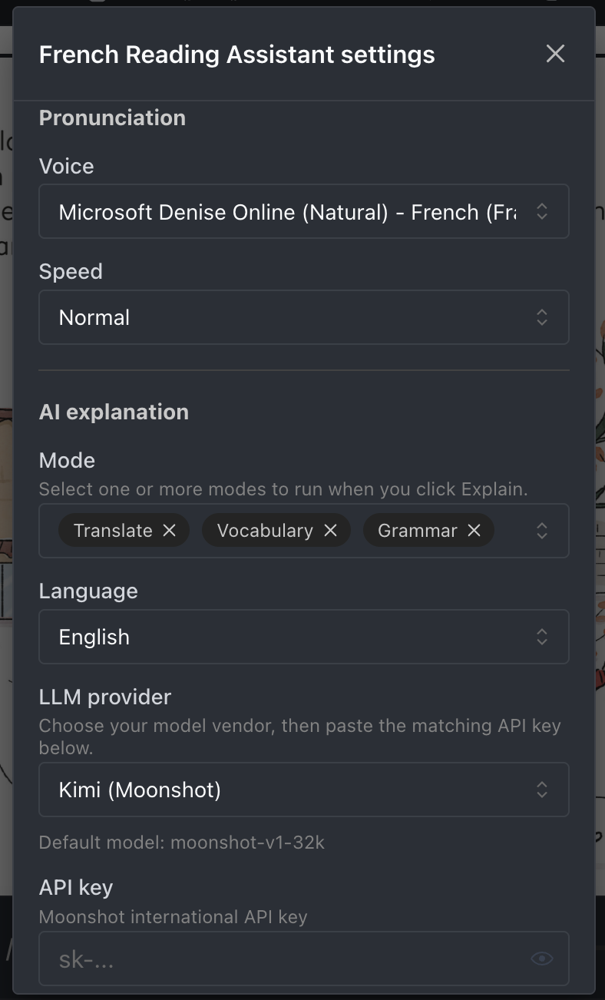

*Figure 8 — Pronunciation: voice and speed.*

---

## AI explanation

1. **Settings → AI explanation:**
   - Modes: Translate / Vocabulary / Grammar (multi-select)
   - Output language: 中文 or English
   - **LLM provider** (default Kimi) + API key → **Save settings**
2. Click **Explain** in the sidebar.
3. Streaming output per mode; **Stop** anytime.

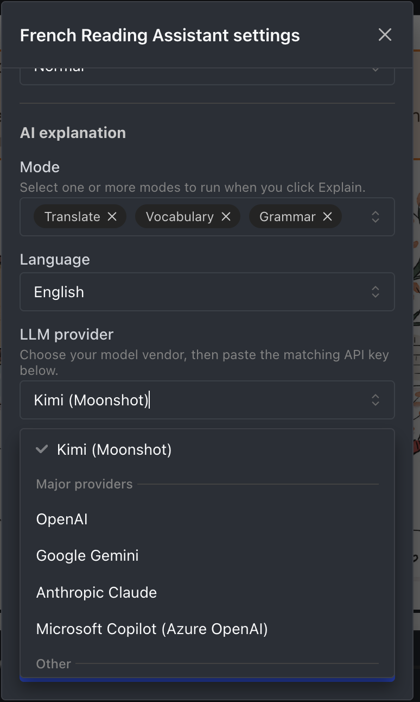

*Figure 9 — LLM provider list.*

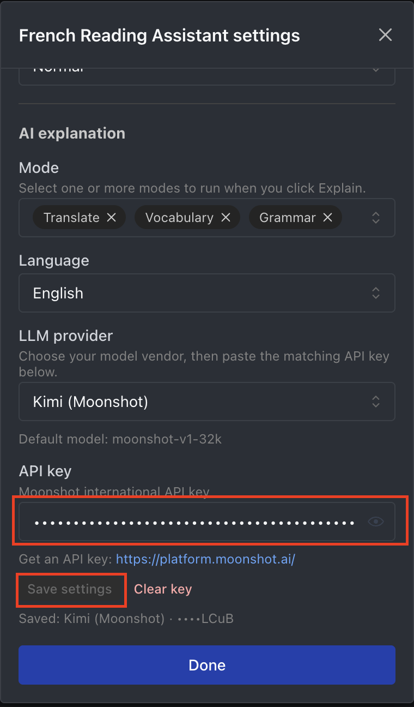

*Figure 10 — Paste API key and Save settings.*

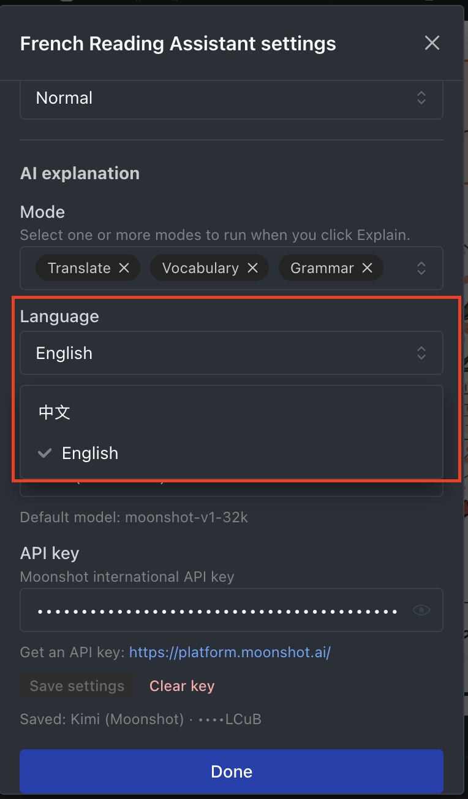

*Figure 11 — Output language for explanations.*

*Figure 12 — Translate + Vocabulary panels.*

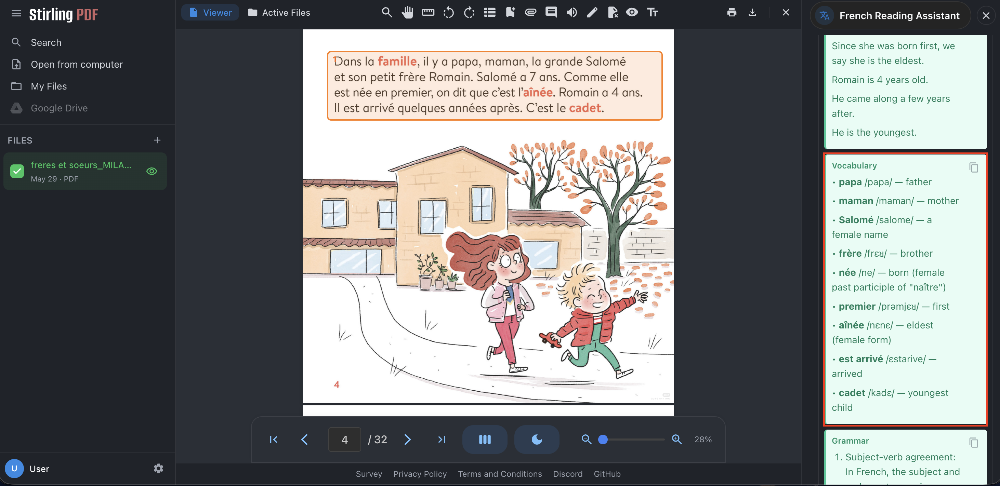

*Figure 13 — Vocabulary with IPA and definitions.*

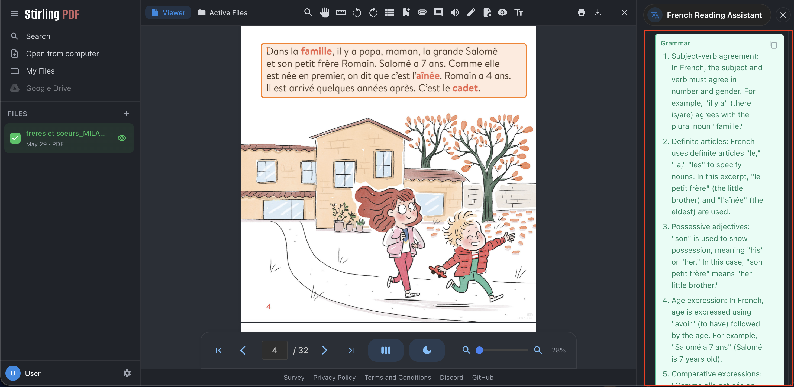

*Figure 14 — Grammar explanations.*

**Chinese output**

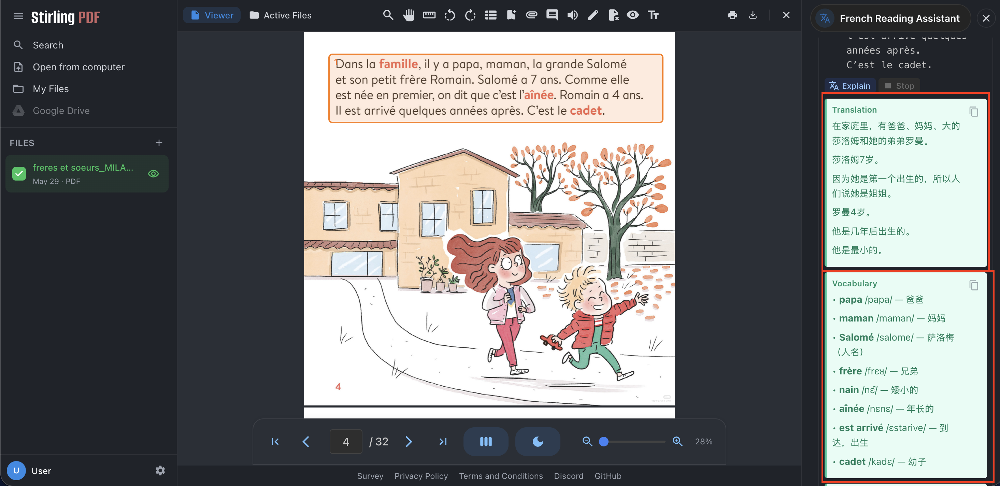

*Figure 15 — Explanation language set to 中文.*

*Figure 16 — Grammar section in Chinese.*

**Comic workflow**

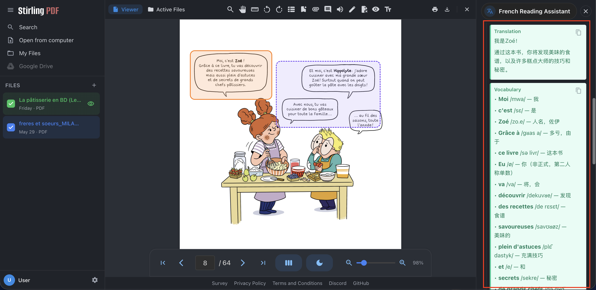

*Figure 17 — AI output for comic bubble text.*

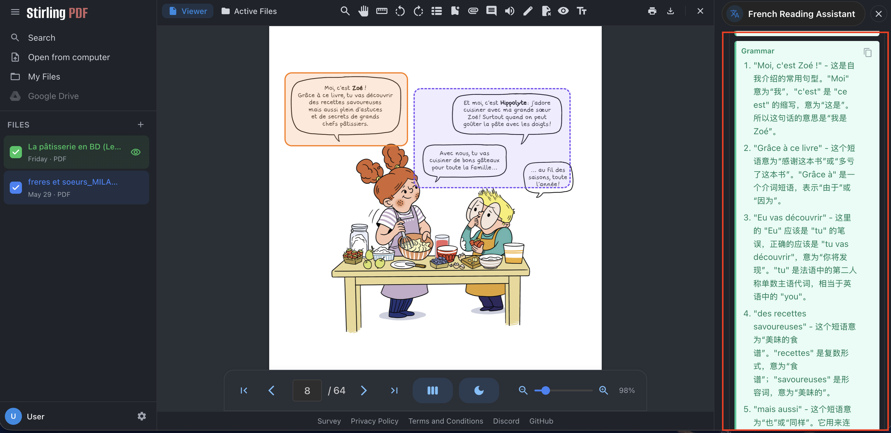

*Figure 18 — Grammar notes for comic dialogue.*

Yellow banner if no API key is configured.

---

## History and export

- Each OCR is saved to **History**.
- Export: **PDF** → **Markdown** → **TXT** (sidebar menu).
- PDF export includes recognized text and AI explanations.

*Figure 19 — History entry (see also README preview).*

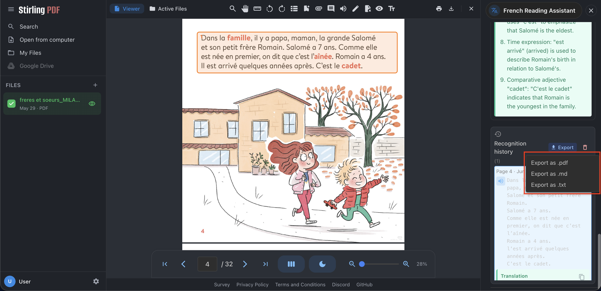

*Figure 20 — Export dropdown.*

*Figure 21 — PDF export sample (see also README preview).*

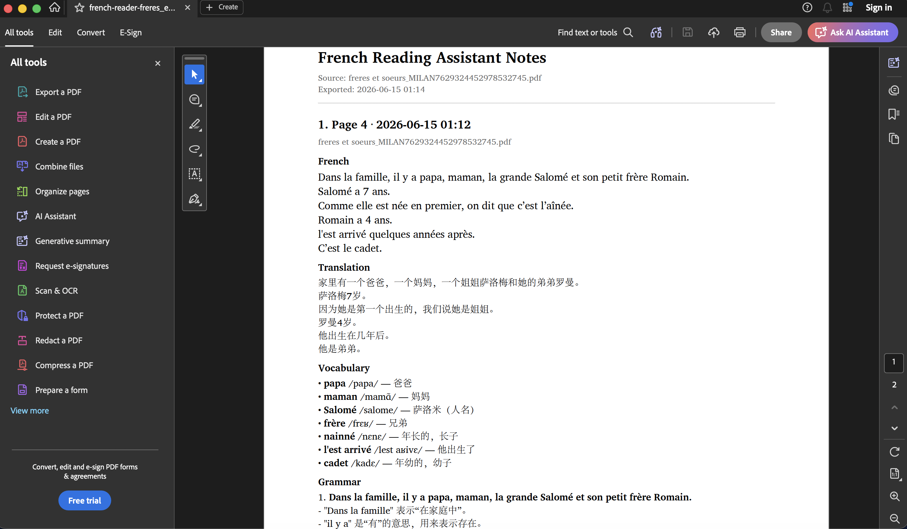

*Figure 22 — PDF export with Chinese explanations.*

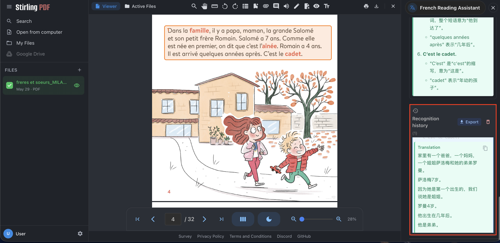

*Figure 23 — History panel with Chinese translation.*

---

## Settings reference

| Section | Options |
|---------|---------|
| Pronunciation | French voice, speed |
| AI explanation | Modes, language, LLM provider, API key |
| LLM providers | Kimi, OpenAI, Gemini, Claude, Copilot (Azure), etc. |

Copilot / Custom need endpoint and model/deployment name.

---

## FAQ

| Issue | Action |
|-------|--------|
| Tool missing | `FRENCH_READER_ENABLED=true` and `./scripts/install-extensions.sh` |
| OCR fails | `./scripts/setup-ocr.sh`; check engine `:5002` |
| AI unavailable | Key in Settings or `.env` |
| TTS fails | Network for edge-tts; on macOS portable use latest build (Web Audio playback) |
| Docker: no tool | Use **this repo’s** extended Stirling image, not stock Stirling-only |
| Desktop: no OCR/AI | Run sidecar / portable launcher; keep terminal open on macOS |

---

## Related

- [Stirling PDF (upstream)](https://github.com/Stirling-Tools/Stirling-PDF)
- [Getting started](getting-started.md)
- [Sidecar fallback](../deployment/sidecar-fallback.md)
- [Screenshot index](../../screenshots/README.md)
