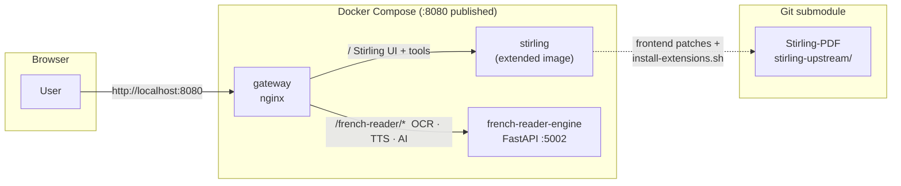
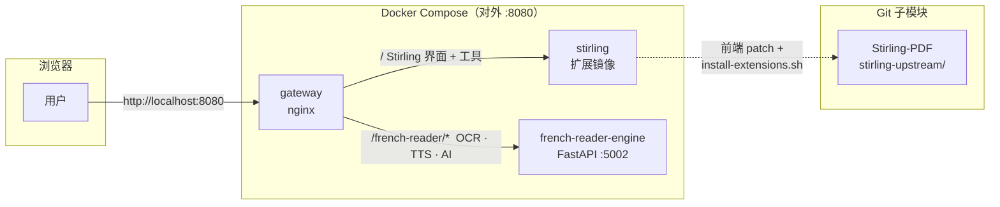
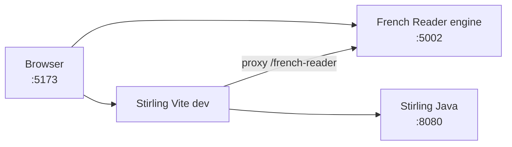

# Architecture / 架构图

**French Reading Assistant** extends [**Stirling PDF**](https://github.com/Stirling-Tools/Stirling-PDF) via `extensions/` and a FastAPI **sidecar** (`:5002`). Stirling core Java backend is not forked for French Reader logic.

**French Reading Assistant** 通过 `extensions/` 与 FastAPI **sidecar**（`:5002`）扩展 [**Stirling PDF**](https://github.com/Stirling-Tools/Stirling-PDF)，法语能力不在 Stirling Java 核心中实现。

[English](#docker-deployment) · [中文](#docker-部署) · [Development / 开发模式](#development-mode)

---

## Docker deployment



| Component | Role |
|-----------|------|
| **gateway** | Single entry port; proxies Stirling and `/french-reader` API |
| **stirling** | [Stirling PDF](https://github.com/Stirling-Tools/Stirling-PDF) + French Reader Tool UI (built from this repo) |
| **french-reader-engine** | PaddleOCR / Tesseract, edge-tts, multi-vendor LLM |
| **stirling-upstream/** | Upstream submodule; synced with `./scripts/sync-upstream.sh` |

---

## Docker 部署



| 组件 | 作用 |
|------|------|
| **gateway** | 统一入口；转发 Stirling 与 `/french-reader` API |
| **stirling** | [Stirling PDF](https://github.com/Stirling-Tools/Stirling-PDF) + French Reader 工具 UI |
| **french-reader-engine** | OCR、edge-tts、多厂商 LLM |
| **stirling-upstream/** | 上游子模块；`./scripts/sync-upstream.sh` 同步 |

---

## Development mode



Run: `./scripts/dev.sh` — see [dev-setup.md](../../dev-setup.md).

开发：`./scripts/dev.sh` — 见 [dev-setup.md](../../dev-setup.md)。

---

## Repository layout

```text
FrenchReadingAssisstant-stirlingPDF/
├── stirling-upstream/          ← submodule → Stirling-Tools/Stirling-PDF
├── extensions/
│   ├── french-reader-frontend/   → copied into Stirling frontend
│   └── french-reader-engine/     → sidecar API
├── docker/
│   ├── stirling-extended/
│   ├── french-reader-engine/
│   └── gateway/
└── scripts/install-extensions.sh
```

Detailed design: [plan/02-architecture.md](../../plan/02-architecture.md).
