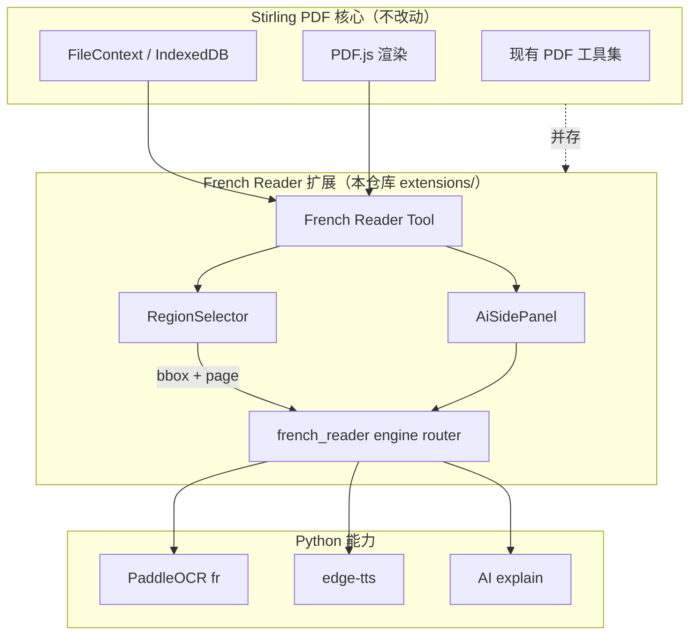
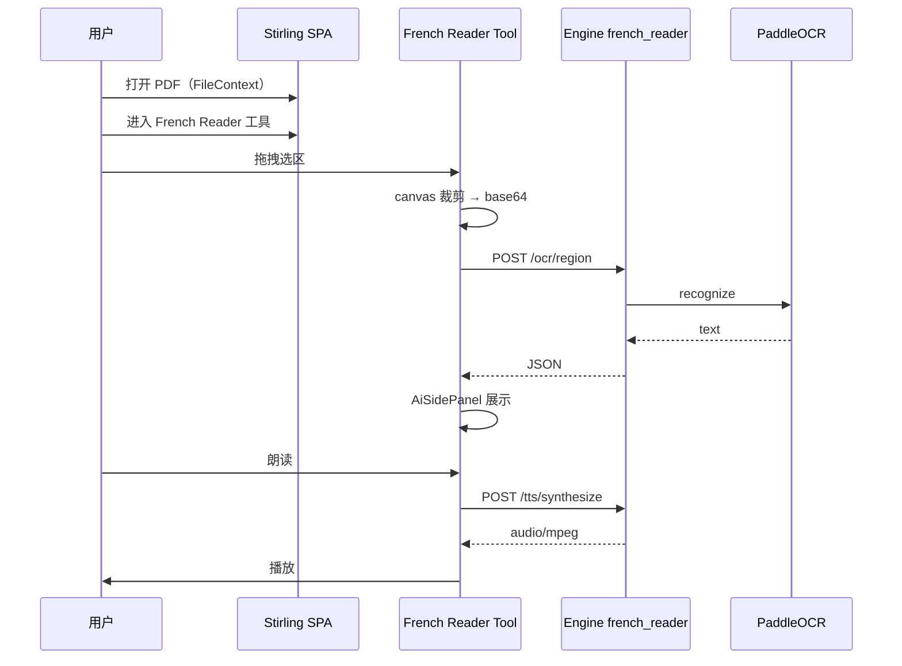

# 02 — 架构设计

## 总体架构（Stirling PDF + 插件扩展）

以 **Stirling PDF Fork** 为基座，法语阅读增强作为 **独立扩展模块** 挂载：新增 Tool + Engine Router，**不修改** Stirling 现有 Tool 与 Controller。



> 集成细节见 [06-stirling-integration-strategy.md](06-stirling-integration-strategy.md)

## 模块划分

### 1. Stirling 基座（只读 / 最小注册改动）

**保留能力**：合并、拆分、转换、Tesseract OCR 工具、AI Agent Chat、Tauri 桌面、FileContext。

**允许的「触点」**（仅此几处）：

| 触点 | 改动 |
|------|------|
| `useTranslatedToolRegistry.tsx` | 追加 `frenchReader` 工具条目 |
| `engine` 主入口 | 追加 `include_router(french_reader_router)` |
| `translation.json` | 追加 i18n 键 |
| （可选）Java 代理 Controller | **新增** `FrenchReaderProxyController` |

### 2. French Reader Tool（前端扩展）

**职责**：在 Stirling SPA 内提供「阅读 + 框选 + 侧栏」布局

- 复用 **FileContext** 当前 PDF，无需重新上传
- 在 PDF.js canvas 上叠加 **RegionSelector**（归一化 bbox + pageIndex）
- 右侧 **AiSidePanel**：OCR 文本、TTS、AI 区块
- 使用 `ToolType.custom` + `useBaseTool`，独立 operation config

**API 调用**：

- 开发：`POST http://localhost:5001/french-reader/...`（Vite proxy）
- 生产：`POST /api/v1/french-reader/...`（Java 代理 → engine）

### 3. Engine 扩展 — OCR（Python）

```
POST /french-reader/ocr/region
{
  "file_key": "...",           // FileContext 文件标识，或 base64 页图
  "page": 3,
  "bbox": { "x": 0.12, "y": 0.34, "w": 0.28, "h": 0.09 },
  "lang": "fr",
  "image_base64": "..."        // MVP：客户端 canvas 裁剪上传
}
→ { "text": "...", "confidence": 0.94, "lines": [...] }
```

**流程（MVP）**：

1. 前端 canvas 裁剪选区 → PNG base64
2. engine `ocr_service` → PaddleOCR `lang=fr`
3. 后处理：法语断行、标点

**P1 服务端渲染**：engine 接收 PDF bytes + 页码，PyMuPDF 渲染后裁剪。

**漫画 P1**：

```
POST /french-reader/ocr/auto-bubbles
→ [{ "bbox": {...}, "text": "...", "confidence": ... }]
```

### 4. Engine 扩展 — TTS（Python）

```
POST /french-reader/tts/synthesize
{ "text": "Bonjour!", "voice": "fr-FR-DeniseNeural", "rate": "+0%" }
→ audio/mpeg
```

MVP：**edge-tts**；预留 Piper 离线。

### 5. Engine 扩展 — AI 增强（P1）

复用 Stirling Engine 已有 LLM 配置：

```
POST /french-reader/ai/explain
{ "text": "...", "mode": "vocabulary" | "grammar" | "translate" }
→ SSE 流式
```

### 6. Java 薄代理（可选，M2+）

```
POST /api/v1/french-reader/ocr/region → forward → engine:5001
```

参考 Agent Chat SSE 代理；**不修改**现有 API。

## 数据流（框选 → OCR → TTS）



## 目录结构（FrenchPdfReader 仓库）

```
FrenchPdfReader/
├── docs/
├── stirling-upstream/              # git submodule: Stirling-PDF
├── extensions/
│   ├── french-reader-engine/       # Python OCR/TTS/AI
│   ├── french-reader-frontend/     # React Tool 组件
│   └── french-reader-java/         # 可选 Java 代理
├── scripts/
│   ├── install-extensions.sh
│   ├── sync-upstream.sh
│   └── dev.sh
├── patches/                        # 对 Stirling 的最小 patch 片段
└── README.md
```

## 功能开关

```yaml
# docker-compose / 环境变量
FRENCH_READER_ENABLED: "true"   # false 时隐藏 Tool，核心不变
```

## 安全与隐私

- PDF 默认本地（Stirling IndexedDB + 本地 engine）
- edge-tts / 云端 LLM 需在 French Reader 设置中明示
- OCR 请求仅发送选区图像，非整书外传（除非用户启用云 LLM 送全文）

## 备选：Sidecar 模式

若 upstream 合并困难，French Reader 以独立路由 `/french-reader` sidecar 运行，Stirling 工具栏增加外链入口，**零改 Stirling 源码**（降级方案）。
