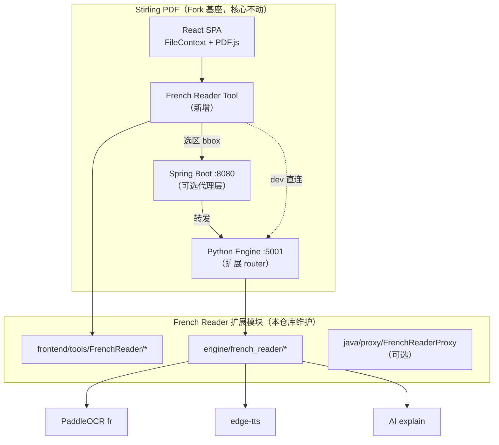

# 06 — Stirling PDF 集成策略（优先方案）

## 决策

**基座选定：Stirling PDF（Fork + 插件式扩展）**

目标：在保留 Stirling PDF 全部核心能力（合并、拆分、OCR 工具、AI Agent、桌面版等）的前提下，以 **最小侵入** 方式挂载「法语阅读增强」模块。

## 设计原则

| 原则 | 说明 |
|------|------|
| **不改动核心逻辑** | 不修改现有 Tool 的 Controller / Operation；仅新增文件 + 注册项 |
| **命名空间隔离** | 新代码集中在 `french-reader/` 前缀目录 |
| **可开关** | 环境变量 `FRENCH_READER_ENABLED`（默认 true），便于上游合并与 A/B |
| **可合并上游** | 与 Stirling 主分支冲突面控制在：工具注册、i18n、Docker 环境变量 |
| **复用现有能力** | FileContext、PDF.js、Engine FastAPI、Tauri 打包、Agent Chat 代理模式 |

## 集成模式对比

| 模式 | 侵入性 | 推荐阶段 | 说明 |
|------|--------|----------|------|
| **A. 引擎插件 + 前端 Tool** | 低 | **MVP** | 在 `engine/` 加 router，在 `frontend` 注册新 Tool |
| **B. Java 薄代理** | 低 | M2+ | Spring 转发 OCR/TTS 到 engine（统一 8080 端口，参考 Agent Chat） |
| **C. 独立 sidecar 服务** | 最低 | 备选 | French 模块独立容器，Stirling 通过 URL 跳转；核心零改动 |
| **D. 深改核心 Viewer** | 高 | ❌ 不做 | 修改共享 PDF 组件，易与上游冲突 |

**推荐路径：A → B**，不做 D。

## 目标架构



## 仓库组织（FrenchPdfReader 项目）

本仓库作为 **文档 + 扩展模块 + 同步脚本**，Stirling 以 submodule 或 fork 引入：

```
FrenchPdfReader/
├── docs/                              # 计划与进度（已有）
├── stirling-upstream/                 # git submodule → Stirling-Tools/Stirling-PDF
├── extensions/
│   ├── french-reader-engine/          # Python：OCR / TTS / AI
│   │   ├── pyproject.toml             # 额外依赖 paddleocr, edge-tts
│   │   └── french_reader/
│   │       ├── router.py
│   │       ├── ocr_service.py
│   │       └── tts_service.py
│   ├── french-reader-frontend/        # React：Tool 组件
│   │   └── src/
│   │       ├── tools/FrenchReader.tsx
│   │       ├── components/
│   │       │   ├── RegionSelector/
│   │       │   └── AiSidePanel/
│   │       └── hooks/tools/frenchReader/
│   └── french-reader-java/            # 可选 Java 代理 Controller
│       └── FrenchReaderProxyController.java
├── scripts/
│   ├── install-extensions.sh          # 将 extensions 链接/复制到 stirling-upstream
│   ├── sync-upstream.sh               # 拉取 Stirling 最新并 rebase
│   └── dev.sh                         # task dev 包装
└── README.md
```

**安装扩展时**（`scripts/install-extensions.sh`）：

1. 将 `french_reader` Python 包挂载到 `stirling-upstream/engine/french_reader/`
2. 在 `engine` 主 app 中 **一行 import** 注册 router（唯一 engine 核心改动点）
3. 将 frontend 组件复制到 `frontend/editor/src/tools/FrenchReader/` 等路径
4. 生成 **patch 片段**：`tool-registry.patch`、`i18n-en.patch`（便于 upstream merge）

## 前端：French Reader Tool

### 注册方式（遵循 ADDING_TOOLS.md）

| 步骤 | 文件 | 改动类型 |
|------|------|----------|
| 1 | `extensions/.../FrenchReader.tsx` | **新增** |
| 2 | `hooks/tools/frenchReader/useFrenchReaderOperation.ts` | **新增**，`ToolType.custom` |
| 3 | `data/useTranslatedToolRegistry.tsx` | **追加** 一条 `frenchReader` 条目 |
| 4 | `public/locales/en/translation.json` 等 | **追加** i18n 键 |
| 5 | 路由 | 随 Tool Registry 自动生成 |

### Tool 分类建议

- **categoryId**：新建 `LEARNING` 或归入 `ADVANCED_TOOLS`
- **subcategoryId**：`FRENCH_READER` / `LANGUAGE`
- 图标：法语 / 对话气泡主题

### UI 布局（单 Tool 页内）

```
┌─────────────────────────────────────────────────────────────┐
│ Stirling 顶栏 / 文件 tabs（FileContext，复用）                │
├──────────────────────────────┬──────────────────────────────┤
│ PDF.js 画布                   │ AI 增强侧栏（AiSidePanel）    │
│ + RegionSelector overlay      │ · OCR 文本                    │
│   拖拽框选 / 气泡列表          │ · 置信度                      │
│                               │ · TTS 播放                    │
│                               │ · AI 释义（P1）               │
└──────────────────────────────┴──────────────────────────────┘
```

### 与 FileContext 集成

- **不重新上传 PDF**：通过 `useBaseTool` / `FileContext` 读取当前 `selectedFiles`
- 页码、缩放：复用 Stirling 已有 PDF 渲染 hook（调研 `PdfViewer` / editor 组件）
- 选区坐标：相对当前页 canvas 的归一化 bbox `(0~1)`

## 后端：Engine 扩展（Python，主开发面）

Stirling 已有 `engine/`（FastAPI，`task engine:dev` → `:5001`）。French Reader **仅新增子包**：

```python
# engine/french_reader/router.py
from fastapi import APIRouter
router = APIRouter(prefix="/french-reader", tags=["French Reader"])

@router.post("/ocr/region")
async def ocr_region(body: OcrRegionRequest): ...

@router.post("/tts/synthesize")
async def tts_synthesize(body: TtsRequest): ...

@router.post("/ai/explain")
async def ai_explain(body: ExplainRequest): ...
```

**注册点**（engine 主入口唯一改动）：

```python
# engine/app/main.py（或等价入口）— 追加一行
from french_reader.router import router as french_reader_router
app.include_router(french_reader_router)
```

### OCR 实现

| 层级 | 选择 |
|------|------|
| 首选 | **PaddleOCR** `lang=fr`（漫画优于 Stirling 默认 Tesseract） |
| 备选 | 调用 Stirling 已有 Tesseract 管道（整页），区域裁剪仍在本模块 |

页图来源：

1. **客户端裁剪**（MVP）：前端 canvas `toDataURL` 发送选区 PNG → engine OCR（零 Java）
2. **服务端渲染**（P1）：engine 用 PDF bytes + 页码渲染（PyMuPDF）

### TTS

- `edge-tts` 默认；设置页可切换 Piper 离线
- 返回 `audio/mpeg` 或 base64

### AI 增强

- 复用 Stirling Engine 已有 LLM 配置（环境变量 / settings）
- 与 Agent Chat 共用 provider 配置，独立 prompt 模板

## Java 层（可选，M2+）

**目的**：生产环境统一 `8080` 端口，避免前端跨域直连 `:5001`。

参考 Agent Chat 的 SSE 代理模式：

```
POST /api/v1/french-reader/ocr/region  →  proxy  →  engine:5001/french-reader/ocr/region
```

| 文件 | 说明 |
|------|------|
| `FrenchReaderProxyController.java` | **新增**，仅转发 + 鉴权 |
| 现有 Controller | **不修改** |

开发阶段可 **跳过 Java**，Vite proxy 将 `/french-reader/*` 指向 engine。

## 不影响核心的检查清单

合并 / PR 前自检：

- [ ] 未修改任何现有 `@RestController` 业务方法
- [ ] 未修改 `useToolOperation` 共享逻辑
- [ ] 新 Tool 使用 `ToolType.custom`，独立 operation config
- [ ] 新代码均在 `french-reader` / `FrenchReader` 命名空间
- [ ] 功能可通过 `FRENCH_READER_ENABLED=false` 完全隐藏
- [ ] 上游 Stirling 测试 `task check` 仍通过（扩展关闭时）

## 上游同步策略

```bash
# scripts/sync-upstream.sh 流程
git -C stirling-upstream fetch origin main
git -C stirling-upstream merge origin/main   # 或 rebase
./scripts/install-extensions.sh              # 重新应用扩展
task check                                   # 验证
# 冲突预期位置：useTranslatedToolRegistry.tsx, translation.json, engine main.py
```

建议维护 `patches/` 目录（git format-patch），而非大面积手改 Stirling 文件。

## 许可证

- Fork 前阅读 [Stirling-PDF LICENSE](https://github.com/Stirling-Tools/Stirling-PDF/blob/main/LICENSE)
- PaddleOCR：Apache 2.0
- YOLOv8（ultralytics）：注意 AGPL 分发要求
- 本扩展若分发 Docker 镜像，需合规标注上游与扩展部分

## 与里程碑对应

| 里程碑 | Stirling 相关交付 |
|--------|-------------------|
| M0 | submodule + dev 环境 + extensions 骨架 |
| M1 | French Reader Tool 空壳 + FileContext 读 PDF |
| M2 | RegionSelector + engine OCR + 侧栏 |
| M3 | engine TTS + 播放 UI |
| M4 | AI explain（复用 engine LLM） |
| M5 | 气泡检测 |
| M6 | Docker 全量镜像 + Tauri 桌面 + 上游同步文档 |

## 参考链接

- [Stirling DeveloperGuide](https://github.com/Stirling-Tools/Stirling-PDF/blob/main/DeveloperGuide.md)
- [ADDING_TOOLS.md](https://github.com/Stirling-Tools/Stirling-PDF/blob/main/ADDING_TOOLS.md)
- [Stirling 开发环境文档](https://docs.stirlingpdf.com/Installation/Development%20Setup/)
