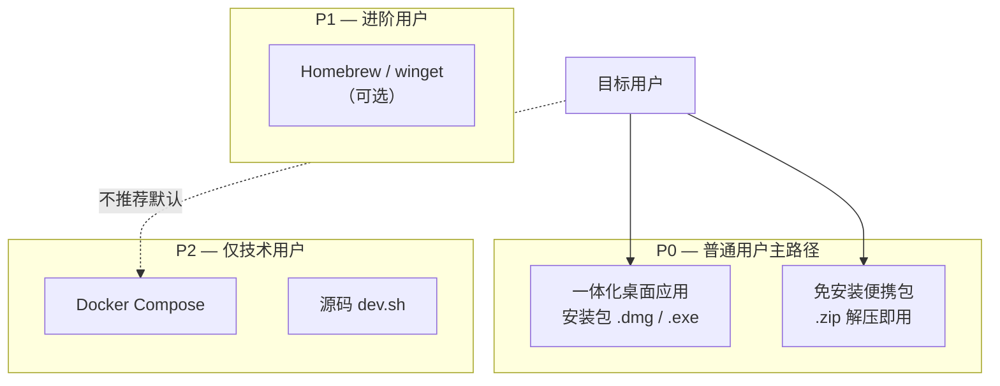

# 10 — 面向普通用户的打包发行策略

> **基座：** [**Stirling PDF**](https://github.com/Stirling-Tools/Stirling-PDF)  
> **本仓库：** [FrenchReadingAssisstant-stirlingPDF](https://github.com/FuyinChe/FrenchReadingAssisstant-stirlingPDF)  
> [English summary](#english-summary)

## 目标用户画像

| 特征 | 说明 |
|------|------|
| 技能 | 会装普通软件、会双击打开，**不会** Docker / Git / 终端 |
| 场景 | 本地阅读法语 PDF / 漫画，框选、朗读、AI 释义 |
| 期望 | **下载 → 打开 → 用**；最好免安装或一步安装 |
| 隐私 | PDF 留在本机；可接受 TTS/LLM 走网络（需在 UI 说明） |

**结论：** Docker 与 `git clone` 适合开发者/自托管，**不应**作为普通用户主路径。

---

## 现状盘点

| 方式 | 用户操作 | 技术门槛 | 完整度 | 适合谁 |
|------|----------|----------|--------|--------|
| `./scripts/dev.sh` | 克隆 + submodule + JDK/Node/uv | 很高 | ✅ 全功能 | 开发者 |
| `docker compose up --build` | 装 Docker Desktop + 等 30–60 分钟构建 | 高 | ✅ 全功能 | 有 IT 背景的自托管 |
| `./scripts/build-desktop.sh` | Rust/JDK/Task + 手动构建 | 高 | ⚠️ **UI 有，sidecar 未随安装包自启** | 开发者预览桌面 |
| `./scripts/desktop-dev.sh` | 同上 + 终端保持运行 | 很高 | ✅ 开发时全功能 | 开发者 |

### 关键缺口

French Reader 依赖 **第二个进程**：Python sidecar（`:5002`，OCR / TTS / AI）。  
当前桌面包只构建了 **Stirling Tauri 壳 + 扩展前端**；`desktop-dev.sh` 在终端里**另外**启动 `uvicorn`，**正式安装包不会自动带起 sidecar**。

普通用户若只双击 Stirling 桌面包，会出现：**工具能打开，OCR/朗读/AI 无响应**（与 [用户手册 FAQ](../zh/user-guide.md) 一致）。

---

## 发行渠道优先级（推荐）



| 优先级 | 形态 | 用户步骤 | 说明 |
|--------|------|----------|------|
| **P0** | **macOS `.dmg` / Windows 安装程序** | 下载 → 安装/拖入应用程序 → 双击图标 | 最接近「装一个 App」 |
| **P0** | **便携包 `.zip`** | 下载 → 解压 → 双击 `启动` | 免管理员权限、U 盘可携带 |
| P1 | Homebrew Cask / winget | `brew install --cask …` | 给稍熟 Mac/Win 用户 |
| P2 | Docker | 见 [getting-started](../zh/getting-started.md) | **文档标注「服务器/技术人员」** |
| P2 | 源码开发 | 见 [dev-setup.md](../dev-setup.md) | 贡献者与维护者 |

**不建议**把 Docker Hub 预构建镜像作为普通用户首选：仍需 Docker Desktop，体积大、故障点多。

---

## P0 方案：一体化桌面应用（推荐架构）

### 运行时组成

```text
用户双击「French Reading Assistant」
        │
        ▼
┌───────────────────┐
│ 启动器 / Tauri    │  ① 启动 french-reader-engine（本机 :5002）
│                   │  ② 等待 /health
│                   │  ③ 启动 Stirling 桌面（Java + WebView，上游已有）
└───────────────────┘
        │
        ▼
  French Reading Assistant Tool（已打入前端）
        │
        └── HTTP → 127.0.0.1:5002/french-reader/*
```

与 [架构图](../images/shared/architecture.md) 一致，但 **gateway/nginx 可省略**（桌面模式直连 localhost）。

### 需要打包进安装包的组件

| 组件 | 来源 | 打包方式（建议） |
|------|------|------------------|
| Stirling 桌面前端 + Tauri | `stirling-upstream` `task desktop:build` | 沿用上游 |
| Stirling Java 后端 | 上游桌面已内嵌 JRE/JAR | 沿用上游 |
| French Reader 前端扩展 | `install-extensions.sh` | 构建前注入 |
| **French Reader engine** | `extensions/french-reader-engine` | **PyInstaller / Nuitka 单文件可执行** |
| **Tesseract + fra** | 系统或捆绑 | 与 engine 同目录，`TESSDATA_PREFIX` |
| OpenCV（气泡/段落） | optional extra `bubble` | 默认捆绑 headless 版 |

**默认消费者构建：** Tesseract OCR only（体积较小）。PaddleOCR 作为「高精度可选组件」后续再加。

### Tauri 集成要点

[Tauri sidecar / `externalBin`](https://v2.tauri.app/develop/sidecar/) 可在应用启动时拉起 `french-reader-engine` 二进制，退出时一并结束。

实现任务（建议里程碑 **M7**）：

1. `scripts/bundle-sidecar.sh` — 各平台 PyInstaller 产出
2. 扩展 Stirling `src-tauri` 配置：`externalBin` + `setup` hook 启动 sidecar
3. `scripts/build-desktop-release.sh` — 一键：install-extensions → bundle sidecar → desktop:build
4. 健康检查失败时 UI 提示（而非静默失败）

### 各平台交付物

| 平台 | 安装版 | 便携版 |
|------|--------|--------|
| macOS Apple Silicon | `French-Reading-Assistant-{ver}-macos-arm64.dmg` | `.zip` 含 `.app` |
| macOS Intel | `…-macos-x64.dmg` | 同上 |
| Windows | `…-windows-x64-setup.exe`（NSIS） | `…-windows-x64-portable.zip` |
| Linux | AppImage（可选，优先级低） | `.tar.gz` |

### 普通用户说明页（随 Release 附 README）

1. 下载对应系统安装包  
2. 双击安装（Mac 可能需在「隐私与安全性」允许一次）  
3. 打开软件 → 打开 PDF → **Recommended tools → French Reading Assistant**  
4. （可选）Settings 里填 LLM API Key  
5. **无需** Docker、Git、终端  

配图占位：见 [docs/images/user-guide/](../images/README.md)。

---

## 体积与网络预期（管理用户预期）

| 项目 | 大致预期 |
|------|----------|
| 安装包体积 | 约 300 MB–1 GB（含 JRE、Tesseract、OpenCV；含 Paddle 更大） |
| 离线 | PDF 阅读、框选、Tesseract OCR 可离线 |
| 需网络 | edge-tts 朗读、云端 LLM 释义 |
| 首次启动 | 可能 10–30 秒（解压/JRE/sidecar 就绪） |

在用户手册中明确写出，避免「为什么朗读要联网」类困惑。

---

## 发布与更新

| 阶段 | 做法 |
|------|------|
| 内测 | GitHub **Releases** 附 `.dmg` / `.zip`，Pre-release |
| 正式 | 版本号 + CHANGELOG；中/英 Release Notes |
| 自动构建 | GitHub Actions：`macos-latest` + `windows-latest` 矩阵 |
| 更新 | Tauri updater（与 Stirling 对齐）或「下载新版本覆盖安装」 |

签名：

- **macOS**：Apple Developer 签名 + notarize（否则 Gatekeeper 拦截）
- **Windows**：Authenticode（SmartScreen）

无签名时须在文档中写清「右键 → 仍要打开」步骤（配截图）。

---

## 合规提示

- Stirling 为**混合许可**，`engine/` 有商业条款；**再分发桌面包**前阅读 [07-license-compliance.md](07-license-compliance.md) 与 [Stirling LICENSE](https://github.com/Stirling-Tools/Stirling-PDF/blob/main/LICENSE)。
- 发行名称建议体现：**French Reading Assistant**，并注明 **Powered by Stirling PDF**（与 `docker-compose` `UI_HOMEDESCRIPTION` 一致）。

---

## 分阶段路线图（建议 M7）

| 阶段 | 交付 | 用户价值 |
|------|------|----------|
| **M7.1** | 各平台 **启动脚本**（sidecar + 已有桌面包）+ 便携 zip 文档 | 内部/早鸟用户可「解压双击」 |
| **M7.1a** | **Windows zip 脚本** — `build-portable-windows.ps1` + [windows-portable-packaging.md](../deployment/windows-portable-packaging.md) | Windows 测试者可打包验证 |
| **M7.2** | PyInstaller sidecar + Tesseract 捆绑 | 单文件夹完整功能 |
| **M7.3** | Tauri 自动拉起 sidecar | 真正一键，无终端 |
| **M7.4** | CI Release + 中英安装说明 + 截图 | 公开发布 |
| **M7.5** | 代码签名 + 自动更新 | 体验接近商业软件 |

---

## 文档与产品表述调整

| 文档 | 调整 |
|------|------|
| 根 README | 普通用户：**Releases 桌面包**；开发者：Docker / 源码 |
| [zh/getting-started.md](../zh/getting-started.md) | 增加「我是普通用户」折叠/章节，Docker 降为「高级」 |
| [user-guide](../zh/user-guide.md) | 增加「首次安装 macOS/Windows」截图位 |

---

## English summary

### Goal

End users (no IT/Docker skills) should **download → open → use**. Docker and `git clone` remain **developer/self-host only**.

### Gap today

The **Python sidecar** (`:5002`) is not bundled or auto-started in the **production Tauri desktop build**; only `desktop-dev.sh` starts it manually. A bare desktop install will show the Tool but OCR/TTS/AI will fail.

### Recommended primary channel (P0)

**All-in-one desktop app:**

1. Stirling Tauri desktop (with French Reader frontend patches) — reuse upstream `desktop:build`
2. **Bundled `french-reader-engine`** binary (PyInstaller/Nuitka) + Tesseract `fra`
3. Launcher / Tauri `externalBin` starts sidecar → health check → main app
4. Ship **`.dmg` / `.exe` installer** and **portable `.zip`**

### Not recommended for default users

- Docker Compose (requires Docker Desktop, long first build)
- Source `dev.sh` workflow

### Suggested milestone **M7**

M7.1 launcher scripts → M7.2 bundled sidecar → M7.3 Tauri auto-start → M7.4 GitHub Releases + docs → M7.5 code signing & updates.

---

## 相关文档

- [05-milestones.md](05-milestones.md) — M6 打包（Docker/Tauri 脚本）
- [06-stirling-integration-strategy.md](06-stirling-integration-strategy.md)
- [07-license-compliance.md](07-license-compliance.md)
- [架构图](../images/shared/architecture.md)
